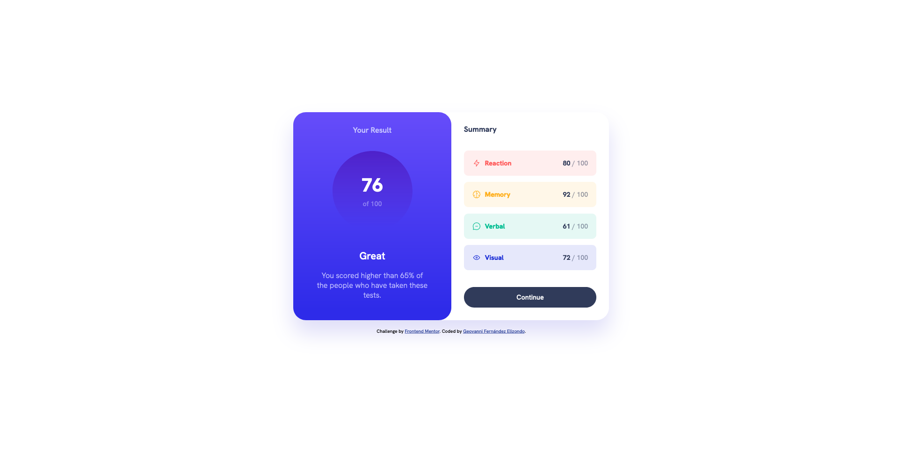

# Frontend Mentor - Results summary component solution

This is a solution to the [Results summary component challenge on Frontend Mentor](https://www.frontendmentor.io/challenges/results-summary-component-CE_K6s0maV). Frontend Mentor challenges help you improve your coding skills by building realistic projects.

## Table of contents

- [Overview](#overview)
  - [The challenge](#the-challenge)
  - [Screenshot](#screenshot)
  - [Links](#links)
- [My process](#my-process)
  - [Built with](#built-with)
  - [What I learned](#what-i-learned)
- [Author](#author)

## Overview

### The challenge

Users should be able to:

- View the optimal layout for the interface depending on their device's screen size
- See hover and focus states for all interactive elements on the page
- **Bonus**: Use the local JSON data to dynamically populate the content

### Screenshot



### Links

- Solution URL: [Add solution URL here](https://your-solution-url.com)
- Live Site URL: [https://results-summary-component-gfz.netlify.app/](https://results-summary-component-gfz.netlify.app/)

## My process

### Built with

- Semantic HTML5 markup
- CSS custom properties
- BEM methodology
- Flexbox
- JavaScript
- Local JSON data
- Mobile-first workflow

### What I learned

Through this challenge, I gained experience in dynamically displaying data from a JSON file. By using `fetch` to retrieve the data and then iterating through it to create HTML elements, I successfully rendered the categories and scores onto the webpage.

```js
//HTML References
const categoriesDiv = document.querySelector(".summary-card__categories");
/**
 * Get all categories from data.json
 */
const getCategories = async () => {
  try {
    const response = await fetch("./assets/data/data.json");
    const categories = await response.json();
    for (const category of categories) {
      createCategory(category);
    }
  } catch (error) {
    console.error("Error loading JSON file", error);
  }
};

getCategories();

const createCategory = ({ category, score }) => {
  const categoryDiv = document.createElement("div");
  categoryDiv.className = `category category--${category.toLowerCase()}`;
  categoryDiv.innerHTML = `
    <h3 class="category__title">${category}</h3>
    <p class="category__score">${score} <span>/ 100</span></p>
  `;
  categoriesDiv.append(categoryDiv);
};
```

## Author

- Frontend Mentor - [@Geovanex24](https://www.frontendmentor.io/profile/Geovanex24)
- Twitter - [@geovanex24](https://www.twitter.com/geovanex24)
